# Control Contratista — Diagrama de flujo de trabajo

Documento complementario a [`DOCUMENTACION-Control-Contratistas.md`](DOCUMENTACION-Control-Contratistas.md).  
Describe los flujos operativos del sistema SIRT de Colbeef.

---

## 1. Flujo general del sistema

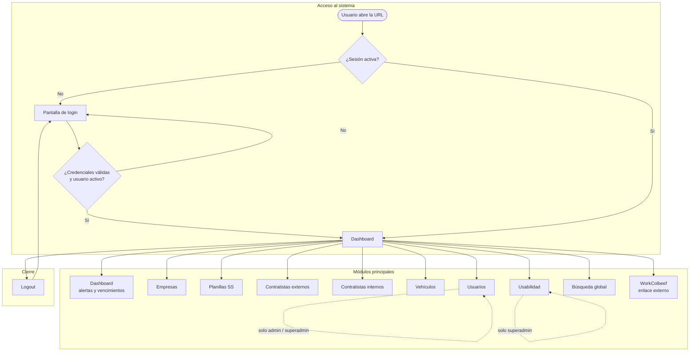

---

## 2. Flujo de autenticación y permisos por rol

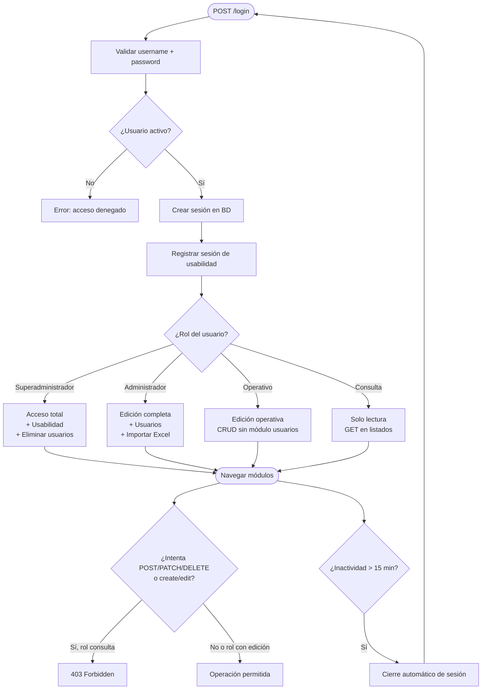

---

## 3. Flujo de alta y clasificación de empresa

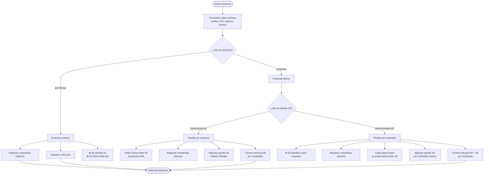

---

## 4. Flujo de planilla de Seguridad Social (SS)

### 4.1 Planilla dependiente (por empresa)

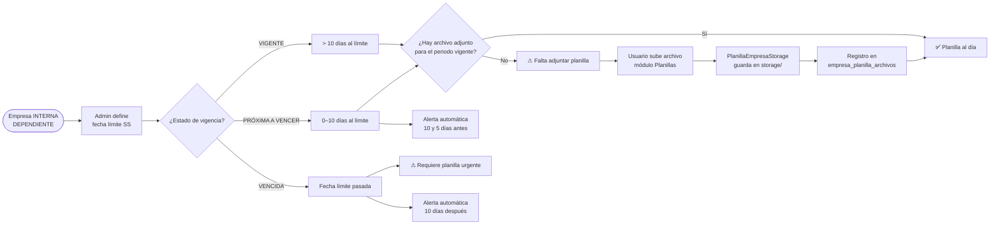

### 4.2 Planilla independiente (por contratista interno)

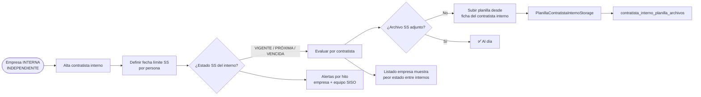

---

## 5. Flujo de gestión de contratista

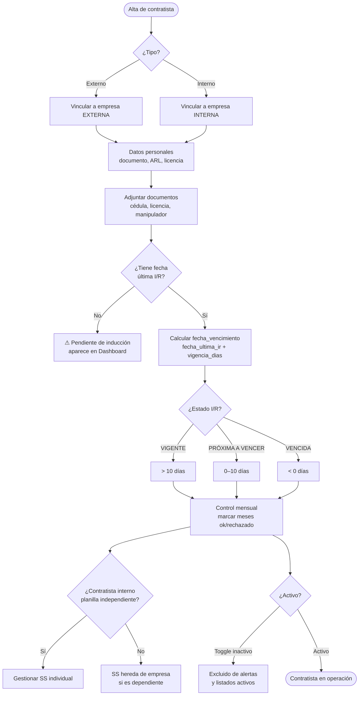

---

## 6. Flujo de control mensual (I/R y SS)

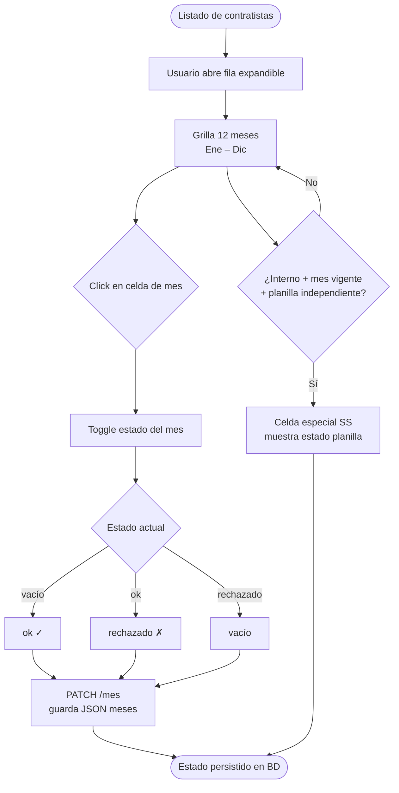

---

## 7. Flujo de alertas automáticas SS

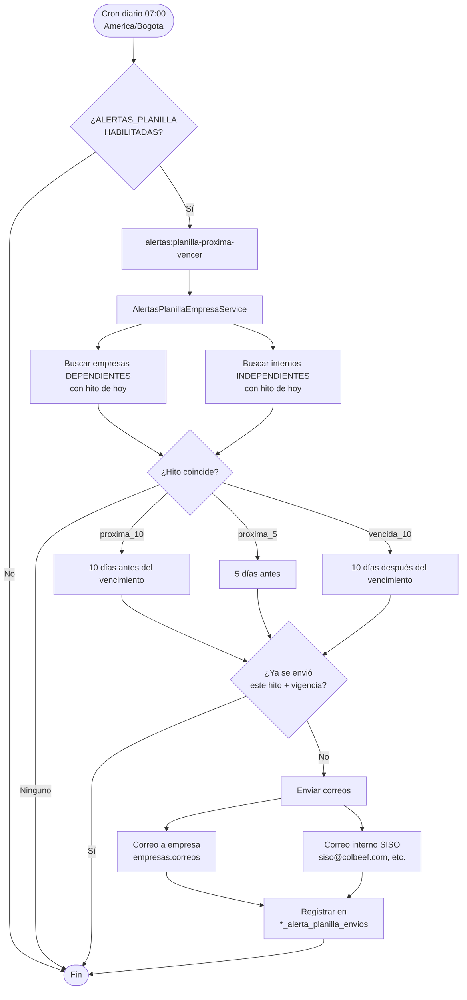

---

## 8. Flujo operativo diario del equipo SISO

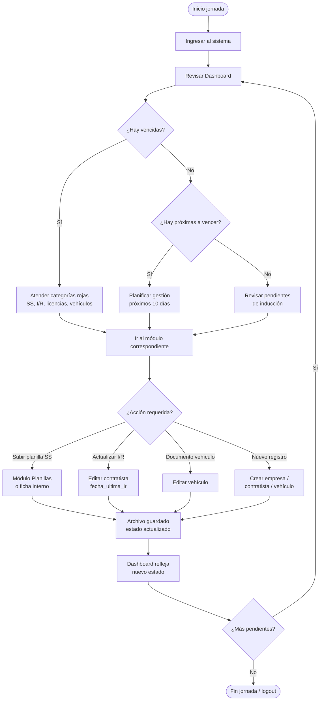

---

## 9. Flujo de importación masiva (Excel → internos)

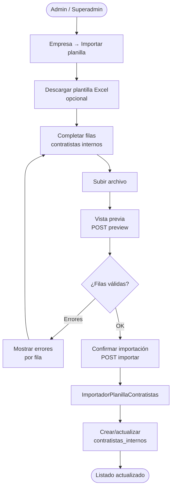

---

## 10. Flujo técnico de una petición HTTP

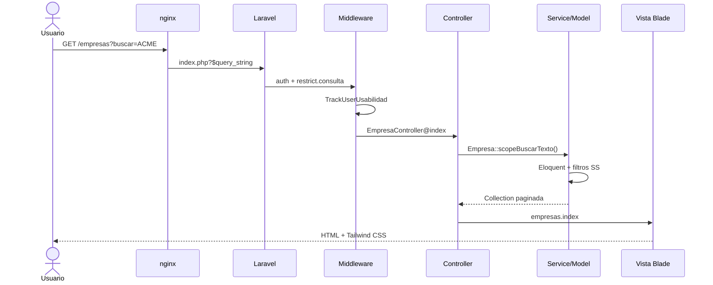

---

## 11. Mapa de decisión — ¿Dónde gestiono la planilla SS?

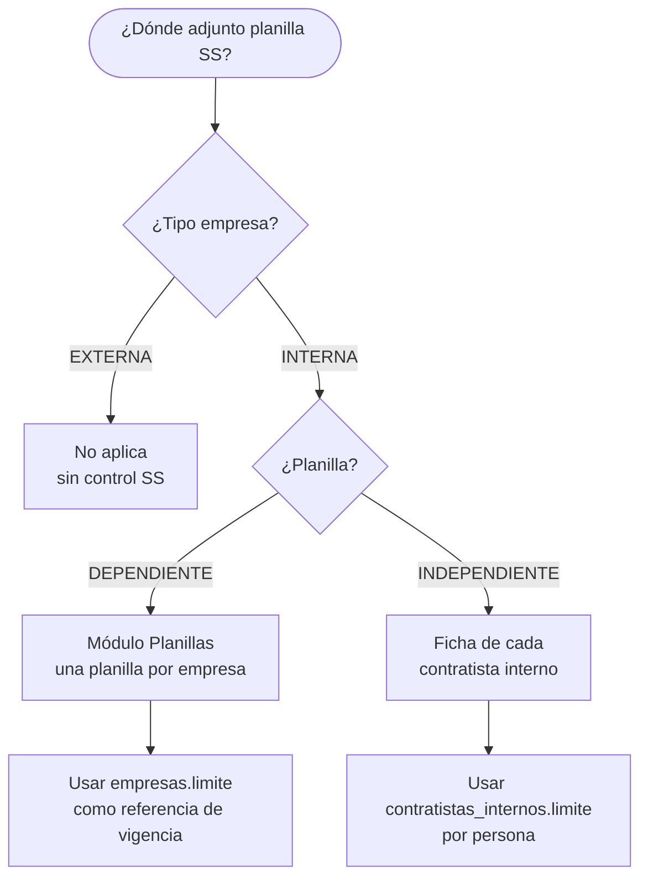

---

## Leyenda de símbolos

| Símbolo | Significado |
|---------|-------------|
| `([ ])` | Inicio / fin de proceso |
| `{ }` | Decisión |
| `[ ]` | Acción / paso |
| `-.->` | Acceso restringido por rol |
| `❌` | No aplica en este flujo |
| `⚠` | Requiere atención |
| `✅` | Estado correcto / cumplido |

---

## Cómo visualizar estos diagramas

Los diagramas usan **Mermaid** en este archivo. También están exportados en **PNG** en:

```
docs/diagramas/png/
├── 01-flujo-general.png              ← flujo principal del sistema
├── 02-auth-permisos.png
├── 03-alta-empresa.png
├── 04-planilla-ss-dependiente.png
├── 05-planilla-ss-independiente.png
├── 06-gestion-contratista.png
├── 07-control-mensual.png
├── 08-alertas-automaticas.png
├── 09-operacion-diaria-siso.png
├── 10-importacion-excel.png
├── 11-peticion-http.png
└── 12-mapa-planilla-ss.png
```

Para regenerar los PNG tras editar este archivo:

```bash
node scripts/export-diagramas-png.mjs
```

También se renderizan en GitHub, VS Code / Cursor con extensión Mermaid, o en [mermaid.live](https://mermaid.live).

---

*Complemento de [`DOCUMENTACION-Control-Contratistas.md`](DOCUMENTACION-Control-Contratistas.md) — Control Contratista / Colbeef / SIRT*
